# Flujo de la aplicación

Llumitaula es una PWA Astro que monta componentes React en el navegador. El
dispositivo se vincula primero mediante un código temporal; después cada
monitor inicia sesión con su PIN y accede a los datos autorizados de su centro.

```mermaid
flowchart TD
    browser["Navegador / iPad"] --> route{"Ruta solicitada"}

    route -->|"/setup"| setup["DeviceSetupForm"]
    route -->|"/workers o /app/workers"| workers["WorkersApp"]
    route -->|"/"| layout["MainLayout\ncontenido protegido oculto"]

    subgraph linking["1. Vinculación del dispositivo"]
        setup --> linked{"¿Hay contexto\nen localStorage?"}
        linked -->|Sí| workers
        linked -->|No| identifier["Obtener o generar\ndevice_identifier (UUID)"]
        identifier --> code["Usuario introduce código temporal"]
        code --> claim["Supabase RPC\nclaim_device"]
        claim --> validate["Valida hash, caducidad, usos\ny límites de intentos\n(5 por dispositivo / 30 globales)"]
        validate -->|Inválido| setupError["Error genérico y reintento"]
        validate -->|Válido| deviceLink["Crea o actualiza device"]
        setupError --> code
        deviceLink --> context["RPC get_device_monitors\nrecupera centro y monitores"]
        context --> confirm["Muestra Vinculado a Colegio X\ny espera Continuar"]
        confirm --> persist["Guarda contexto público y el identificador\nen localStorage"]
        persist --> workers
    end

    subgraph monitorAuth["2. Selección y autenticación del monitor"]
        workers --> localCheck{"¿Hay contexto\nde dispositivo?"}
        localCheck -->|No| setup
        localCheck -->|Sí| refresh["RPC get_device_monitors\nactualiza last_seen_at"]
        refresh --> fresh{"¿Respuesta correcta?"}
        fresh -->|Sí| monitorList["Muestra centro y lista de monitores\ny actualiza la caché local"]
        fresh -->|No, hay caché| cached["Muestra lista guardada\ncon aviso"]
        fresh -->|No, sin caché| workersError["Error / reintentar /\nusar otro código"]
        monitorList --> select["Seleccionar monitor"]
        cached --> select
        select --> pin["Introducir PIN"]
        pin --> auth["Supabase Auth\nsignInWithPassword(email, PIN)"]
        auth -->|Fallos repetidos| lock["5 intentos: bloqueo local\n5 minutos"]
        lock --> pin
        auth -->|Correcto| home["Redirección a /"]
    end

    layout --> guard["AuthGuard\nsupabase.auth.getSession()"]
    home --> layout
    guard -->|Sin sesión| setup
    guard -->|Error al consultar sesión| workers
    guard -->|Sesión válida| business["BusinessApp\nlibera el contenido"]

    subgraph dataLoad["3. Carga de datos autorizados"]
        business --> session["Obtiene sesión y usuario"]
        session --> queries["Consultas paralelas a Supabase\nclasses · children · meal_records de hoy\nincidents de hoy · meal_types activos · users.role"]
        queries --> role{"¿Rol monitor?"}
        role -->|Sí| monitorId["Consulta monitors.id\npara el usuario autenticado"]
        role -->|No| classList["Lista de clases del centro\nen orden alfabético"]
        monitorId --> classList
        classList --> classGrid["Seleccionar clase\nfiltra sus niños en memoria"]
    end

    subgraph meals["4. Registro de comida"]
        classGrid --> card["Seleccionar alumno"]
        card --> modal["MealRecordModal\ntipo de comida, estado y notas"]
        modal --> incidentDecision{"¿Hay incidencia y el rol\nes admin o supervisor?"}
        incidentDecision -->|No| upsert["upsert meal_records\nclave: alumno + comida + fecha local"]
        incidentDecision -->|Sí| incident["RPC record_meal_incident\noperación atómica"]
        upsert --> rls1["RLS + triggers\nvalidan usuario, centro y fecha"]
        incident --> rls2["RPC valida rol, centro, fechas\ny crea meal_records + incidents"]
        rls1 --> state["Actualiza estado local\ny muestra FeedbackToast"]
        rls2 --> reload["Recarga incidents del día"]
        reload --> state
    end

    signout["Salir"] --> logout["supabase.auth.signOut()"]
    logout --> setup
    business --> signout

    subgraph backend["Supabase"]
        authdb["Auth: sesión del monitor"]
        db["Postgres: centros, clases, alumnos,\ncomidas, incidencias y monitores"]
        security["RLS / funciones security definer\nseparación por centro y rol"]
    end

    claim -.-> db
    auth -.-> authdb
    queries -.-> db
    upsert -.-> db
    incident -.-> db
    rls1 -.-> security
    rls2 -.-> security

    subgraph pwa["PWA / modo offline"]
        layout --> sw["Service Worker /sw.js"]
        sw --> shell["Cachea el app shell y assets estáticos"]
        shell --> offline["Sin red: solo interfaz cacheada\nno hay datos ni mutaciones de Supabase"]
    end

    classDef public fill:#ecfdf5,stroke:#059669,color:#064e3b;
    classDef protected fill:#eff6ff,stroke:#2563eb,color:#1e3a8a;
    classDef backend fill:#fff7ed,stroke:#ea580c,color:#7c2d12;
    classDef decision fill:#fefce8,stroke:#ca8a04,color:#713f12;
    class setup,workers,setupError,workersError,pin,select public;
    class layout,guard,business,ready,modal,upsert,incident,state protected;
    class authdb,db,security backend;
    class route,linked,validate,fresh,localCheck,role,incidentDecision decision;
```

## Puntos clave

- `/setup`, `/workers` y `/app/workers` son accesibles sin sesión de Supabase.
- `/` permanece oculta hasta que `AuthGuard` confirma una sesión. Tras el login,
  `BusinessApp` muestra siempre la lista de clases del centro; no se guarda ni se
  restaura una "última clase".
- `localStorage` conserva el identificador del dispositivo, el código de
  configuración y el contexto público del centro; no sustituye a Supabase ni a
  sus políticas RLS. La clase seleccionada solo existe en estado interno de la
  pantalla y no se persiste.
- Un registro normal usa `meal_records.upsert`. Una incidencia para `admin` o
  `supervisor` usa `record_meal_incident`, que guarda comida e incidencia en una
  sola operación.
- El service worker solo cachea recursos de la interfaz. No intercepta
  peticiones a Supabase, por lo que las vistas protegidas y las escrituras
  requieren conexión.

## Referencias de implementación

- Entrada y protección: `src/layouts/MainLayout.astro`, `src/components/AuthGuard.tsx`
- Vinculación: `src/components/DeviceSetupForm.tsx`, `src/lib/deviceSetup.ts`
- Monitores: `src/components/WorkersApp.tsx`, `src/components/MonitorPinInput.tsx`
- Operación: `src/components/BusinessApp.tsx`, `src/components/MealRecordModal.tsx`
- Backend: `supabase/migrations/20260824130000_device_setup.sql`,
  `supabase/migrations/20260826000000_get_device_monitors.sql` y
  `supabase/migrations/20260824110000_record_meal_incident.sql`
- PWA: `src/layouts/MainLayout.astro`, `scripts/sw-template.js`
